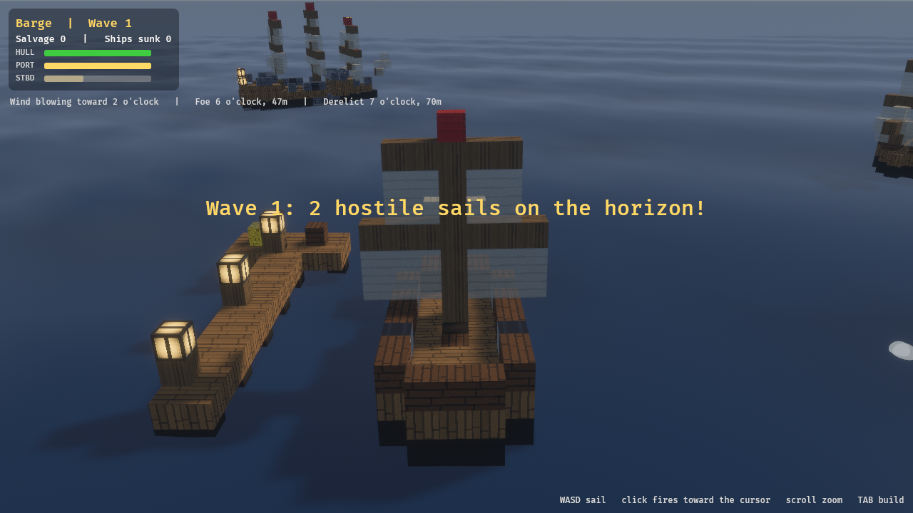
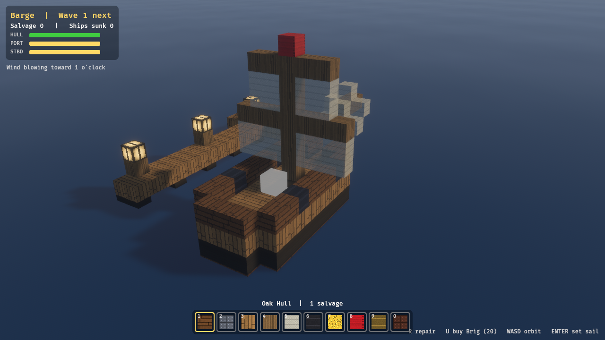

# VoxelPirates

A voxel pirate game built with Rust + Bevy. The world is open sea: every ship
is its own little Minecraft — a voxel grid that sails, floats, takes damage
block by block, and can be rebuilt block by block. Start on a barge, scavenge
the wrecks of your enemies, and grow into a galleon before the Dreadnought
comes for you.



## Building from source

You need a [Rust toolchain](https://rustup.rs/) (edition 2024, so Rust 1.85
or newer). On Linux, Bevy also needs the usual system libraries:

```sh
# Debian/Ubuntu
sudo apt install g++ pkg-config libx11-dev libasound2-dev libudev-dev \
    libxkbcommon-dev libwayland-dev
```

Then:

```sh
cargo run --release
```

The first build compiles Bevy and takes a while; after that it's quick.
A debug `cargo run` works too — `Cargo.toml` sets `opt-level = 3` for
dependencies so it stays playable.

## How to play

Battles come in waves; between them you're safe at the dock — repair,
rebuild, buy a bigger hull, then set sail for the next fight.



| Input | Action |
|---|---|
| `W A S D` | Sail: thrust, turn (turning needs way on the ship) |
| Left click | Fire the broadside facing the cursor |
| Scroll | Zoom the chase camera |
| `Tab` | Toggle build mode |
| `1`-`0` (build) | Select block; click places, right-click removes |
| `Q` / `E` | Keyboard broadsides (fallback) |
| `P` | Pause |
| `R` (dock) | Repair — shipwrights work at half price |
| `U` (dock) | Buy the next hull class |
| `Enter` (dock) | Set sail for the next wave |

## The loop

- Sink ships; their blocks bob up as **flotsam**, and bigger wrecks scatter
  more gold plunder. Sail over it: it repairs your hull first, then banks as
  **salvage**.
- Back at the dock, salvage buys repairs and hull upgrades:
  Barge → Brig → Frigate → Galleon.
- In build mode you spend salvage to reshape your ship — more hull is more
  durability, more cannons is more broadside. Culverins pierce, carronades
  crater.
- Mind the **wind** (intel line): running with it is a quarter faster.
- Derelict wrecks are risk-free salvage. Ramming works, and hurts you both.
- Wave 8 brings the **Dreadnought**. Sink it and the seas are yours; the
  waves keep escalating for as long as you can stay afloat.

## Dev flags

- `--selftest` — scripted smoke test: drives input resources, asserts the
  salvage economy in logs, saves screenshots to `/tmp/selftest_*.png`
- `--demo` — the player ship fights on autopilot, for pacing observation
- `--boss` — skip ahead to the Dreadnought fight in a frigate
- `--diag` — extra diagnostics
- `--mute` — no audio

## Architecture

See `AGENTS.md` (a.k.a. `CLAUDE.md`) for the architecture rules. The short
version: all block properties live in the registry (`src/blocks.rs`), ships
are entities with a ship-local voxel grid (`src/ship.rs`), and gameplay
systems never match on block ids.
